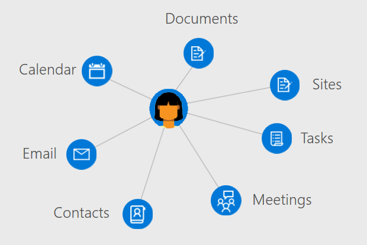

# Users overview

Users are the representation of an Azure Active Directory user account in Microsoft Graph. The Users entity in Microsoft Graph is a hub from which you can access the relationships and resources relevant to your users.

## Develop user-centric applications

Build applications that are aware of a user's relationships, information, and preferences by working with the User entity associated with the current user of your application.

The Microsoft Graph Users entity lets you access the relationships and data associated with a user. The returned Graph entities from these resources-such as messages, contacts, and groups-that you can review and act on in your application. 

To get to access a user's information and data, you'll need to [get access on their behalf](https://developer.microsoft.com/graph/docs/concepts/auth_v2_user) before using the Users resource. Authenticating your with application with [admin consent](https://developer.microsoft.com/en-us/graph/docs/concepts/permissions_reference) enables you to work with and update with a wider range of entities associated with a user.

### Manage users in your organization

Create new users in your organization or update the resources and relationships for existing users with the Users endpoint. 

- Create or delete users in your Azure AD organization
- List a user's group memberships and check if a user is a member of a group.
- List the users who report to a user and assign managers to a user.
- Upload or retrieve a photo for the user.

### Work with user calendars and tasks

Users has direct resources that let you view, query, and update user calendar and calendar groups

- List and create events on a users calendar.
- View assigned tasks to a user.
- Find free meeting times for a set of users.
- Get a list of reminders set on a user's calendar 

### Administer mail and handle contacts

Users provides resources to configure user mail settings and contact lists and to send mail on a user's behalf.

- List mail messages and send new mail.
- Create and list user contacts and organize contacts in folders.
- Retrieve and update mailbox folders and settings.

### Enrich your app with user insights

- Return recently viewed and modified documents by a user.
- Return documents and sites trending around a user's activity.
- List documents shared with a user through email or OneDrive for Business.

## Next steps

- Authenticate with Microsoft Graph [on behalf of a user](https://developer.microsoft.com/en-us/graph/docs/concepts/auth_v2_user) or [as a daemon or service by consent of an administator](https://developer.microsoft.com/en-us/graph/docs/concepts/auth_v2_service).
- Set access control and policies for users with the [Azure AD resource](https://developer.microsoft.com/en-us/graph/docs/api-reference/v1.0/resources/azure_ad_overview)
- Review the [permissions](https://developer.microsoft.com/en-us/graph/docs/concepts/permissions_reference) your app will need to access user data. 
- Stay up to date with the Microsoft Graph [changelog](https://developer.microsoft.com/en-us/graph/docs/concepts/changelog)